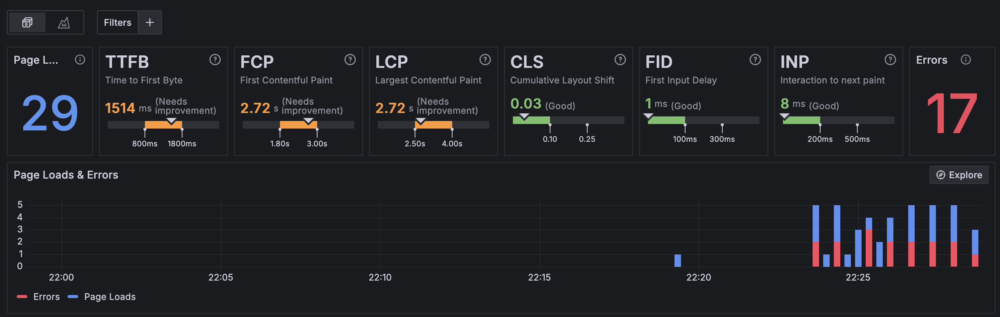
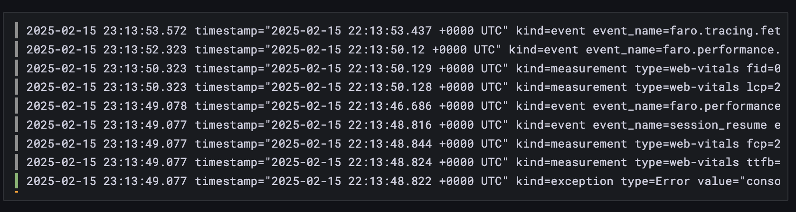
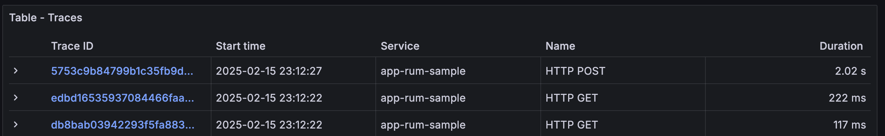
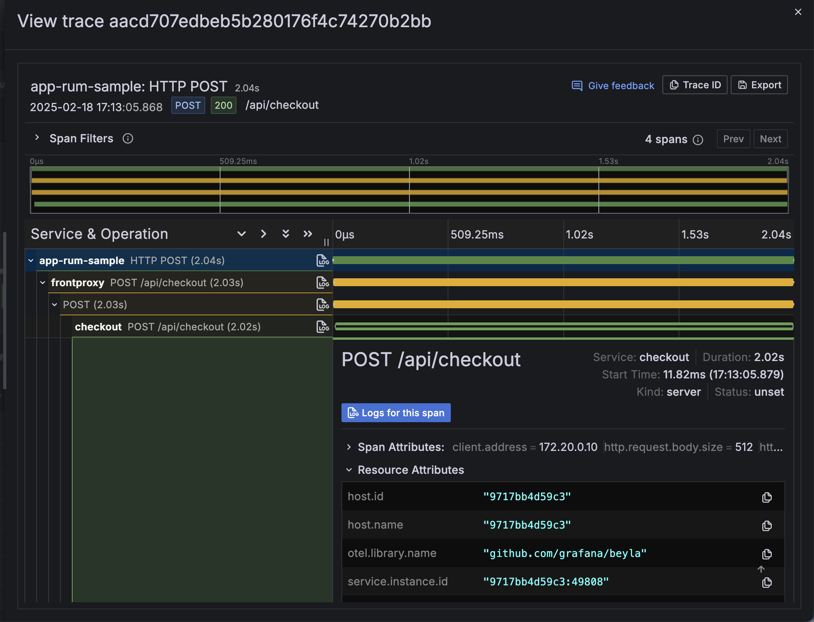

# APM and RUM enablement

This repository is used for training purposes. It contains a set of really small services that communicate with each other.

The goal is to enable everyone to understand the value of APM / Application Observability and RUM / Frontend Observability in Grafana Cloud and to exercise on a small scale what needs to be done to properly set up users for success.

## Overview

Throughout this tutorial you will:

- Enable RUM for the [`frontend`](./frontend) service by adding Grafana Fargo
- Send your telemetry to an instance of [`alloy`](./alloy/)
- Instrument the server-side services [`frontproxy`](./frontproxy/), [`checkout`](./checkout/) and [`products`](./products/) using OpenTelemetry:
  - For the `frontproxy` we will use the NGINX module [nginx-otel](https://github.com/nginxinc/nginx-otel)
  - For the `checkout` service we will use a "don't touch my image" approach to inject  [OpenTelemetry JavaScript zero-code instrumentation](https://opentelemetry.io/docs/zero-code/js/)
  - For the `products` service we will use the [Python zero-code instrumentation](https://opentelemetry.io/docs/zero-code/python/) 
- Improve some configuration to increase security and to transform some telemetry
- Use Grafana beyla as an alternative for instrumenting the services

## Prerequisites

- a local machine
- docker installed
- a fresh Grafana Cloud stack (to ensure you can follow all the steps)
- to cache the images, use `docker compose pull && docker compose build`

## How to use this repository

1. clone the `main` branch of this repository locally
2. pull & build the docker images needed for this exercise (`docker compose build`)
3. start the app (`docker compose up -d`)
4. browse `http://localhost:8000/`
5. make changes to a service, rebuild and restart (`docker compose up -d`)

## Step 1: Enable RUM and send data to Grafana Cloud

As a first step we want to add faro to the [frontend](./frontend/). To do so, create a new
Frontend Observability application in your Grafana Cloud instance, by opening the following
url: <https://acme.grafana.net/a/grafana-kowalski-app/apps/new> (replace `acme` with your Grafana Cloud org name).

Name your application `app-rum-sample` and add the following domain to the allow list for CORS:

- `http://frontproxy:8000`
- `http://localhost:8000`


> [!NOTE]
>
> "_Cross-Origin Resource Sharing (CORS) is an HTTP-header based mechanism that allows a server to indicate any origins (domain, scheme, or port) other than its own from which a browser should permit loading resources_" (source: [MDN](https://developer.mozilla.org/en-US/docs/Web/HTTP/CORS)). By adding the two domains above we can access the sample app locally and telemetry can be send to Grafana Cloud, and the load generator can access the sample app via the container network internal hostname `frontproxy` and telemetry is also send to Grafana Cloud. 


Click next, and as the next step requests, install the faro dependencies:

```
npm install @grafana/faro-web-sdk
npm install @grafana/faro-web-tracing
```

Net, open the [App.js](./frontend/src/App.js) in your preferred editor and add the `React` block from
the "Add Faro to your application section", e.g.

```js
import { matchRoutes } from "react-router-dom";
import {
  initializeFaro,
  createReactRouterV6DataOptions,
  ReactIntegration,
  getWebInstrumentations,
} from "@grafana/faro-react";
import { TracingInstrumentation } from "@grafana/faro-web-tracing";
import FaroSourceMapUploaderPlugin from "@grafana/faro-webpack-plugin";

initializeFaro({
  url: "https://faro-collector-prod-eu-west-2.grafana.net/collect/123456789abcdef123456789abcdef0",
  app: {
    name: "app-rum-sample",
    version: "1.0.0",
    environment: "production",
  },

  instrumentations: [
    // Mandatory, omits default instrumentations otherwise.
    ...getWebInstrumentations(),

    // Tracing package to get end-to-end visibility for HTTP requests.
    new TracingInstrumentation(),

    // React integration for React applications.
    new ReactIntegration({
      router: createReactRouterV6DataOptions({
        matchRoutes,
      }),
    }),
  ],
});
```

Make sure that you replace `123456789abcdef123456789abcdef0` with your real application key.

Click on `Complete`.

Next, we spin up the application using docker compose. In the root folder of this repository run

```
docker compose up
```

Give the container some time to build. When everything is up and running, go to <http://localhost:8000> in your browser. You can use the developer toolbar to verify that everything is working as expected. Go to the `Network` tab
and check for 2 requests going out to `https://faro-collector-prod-eu-west-2.grafana.net/collect/123456789abcdef123456789abcdef0`, one of type `preflight` and one of type `fetch`.

> [!TIP]
>
> If you see `export 'pageMeta' (reexported as 'pageMeta') was not found in '@grafana/faro-web-sdk'` as an error
> the `frontend` service has some outdated faro dependencies in the `package-lock.json` file. Run `rm -rf package-lock.json node_modules` and `npm install` to fix this issue. You need to rebuild your containers afterwards,
> e.g. run `docker compose up --build --no-deps -d frontend` in a second terminal window

After a while you should see data flowing in, like in the screenshot below



## Step 2: Add alloy into the mix

In the next step, we want to send the telemetry from our application to an [alloy](https://grafana.com/docs/alloy/latest/) instance first, before sending it to Grafana Cloud. This can be useful if you clients can not access Grafana Cloud, e.g. in a restricted environment.

As a first step, go to `https://acme.grafana.net/connections/add-new-connection/open-telemetry` (replace `acme` with
the name of your Grafana Cloud instance), and create a new token with name `apm-rum-sample`. Click on `Create token`
Scroll down to `Append the generated configuration to your configuration file at /etc/alloy/config.alloy` and copy the generated configuration file to your clipboard and append the content to your [`config.alloy`](./alloy/config.alloy) via paste. Additionally configure a `faro.receiver`. Your configuration file should look like the following:

```
logging {
  level  = "info"
  format = "logfmt"
}

otelcol.receiver.otlp "default" {
	// configures the default grpc endpoint "0.0.0.0:4317"
	grpc { }
	// configures the default http/protobuf endpoint "0.0.0.0:4318"
	http { }

	output {
		metrics = [otelcol.exporter.otlphttp.grafana_cloud.input]
		logs    = [otelcol.exporter.otlphttp.grafana_cloud.input]
		traces  = [otelcol.exporter.otlphttp.grafana_cloud.input]
	}
}


faro.receiver "default" {
    server {
        listen_address = "0.0.0.0"
        cors_allowed_origins = ["http://frontproxy:8000"]
        // Propagate incoming connection metadata to downstream consumers.
        include_metadata = true
    }

    output {
        logs   = [otelcol.receiver.loki.l2o.receiver]
        traces = [otelcol.exporter.otlphttp.grafana_cloud.input]
    }
}

// use this intermediate receiver to convert loki data to otlp data
// since the faro receiver only supports loki format as log output
otelcol.receiver.loki "l2o" {
  output {
    logs = [otelcol.exporter.otlphttp.grafana_cloud.input]
  }
}

otelcol.exporter.otlphttp "grafana_cloud" {
	client {
		endpoint = "https://otlp-gateway-prod-eu-west-2.grafana.net/otlp"
		auth     = otelcol.auth.basic.grafana_cloud.handler
	}
}

otelcol.auth.basic "grafana_cloud" {
	username = "<USERNAME>"
	password = "<PASSWORD>"
}  
```

Replace `<USERNAME>` and `<PASSWORD>`. Save the modified file and restart your alloy container by running
`docker compose restart alloy`. Next, update your [`App.js`](./frontend/src/App.js) to send frontend telemetry
to alloy:

```js
initializeFaro({
  url: 'http://alloy:12347/collect',
  // ...
});
```

When you have setup your application this way logs and traces will flow into your Grafana Cloud instance.




> [!NOTE]
>
> **Question 1**: It looks like this way it is not possible to populate data into "Frontend Observability". If
> the `https://faro-collector-prod-eu-west-2.grafana.net/collect/<key>` endpoint is used as sink for a loki
> writer and OTLP traces, the loki writer reports issues with missing `X-Faro-Session-Id` header. There was no
> obvious way to reconfigure alloy to send those headers accordingly. Do I miss something?

## Step 3: Add backend telemetry

With our frontend instrumented, we also want to add OpenTelemetry to the different backend services for full
end-to-end visibility. There are 3 components: [`frontproxy`](./frontproxy/), [`checkout`](./checkout/) and
[`products`](./products/). We will address them one by one.

### Instrumenting the `frontproxy`

The `frontproxy` is an NGINX. We can use one of the available NGINX OpenTelemetry modules, e.g. [ngx_otel_module](https://github.com/nginxinc/nginx-otel). Adding it to the existing configuration is straight forward, since the docker image we are using has the module already preinstalled. Update the `nginx.conf` with the following content:

```
load_module modules/ngx_otel_module.so;

events {
    use           epoll;
    worker_connections  128;
}

http {
    server_tokens off;
    include       mime.types;
    charset       utf-8;

    server {
        listen        0.0.0.0:8000;

        location /api/products {
            proxy_pass         http://products:8002;
        }

        location /api/checkout {
            proxy_pass         http://checkout:8003;
        }

        location / {
            proxy_pass         http://frontend:8001;
        }
    }

    otel_trace on;
    otel_service_name frontproxy;
    otel_trace_context propagate;
    add_header server-timing "traceparent;desc:\"00-$otel_trace_id-$otel_span_id-0$otel_parent_sampled\"";

    otel_exporter {
        endpoint    alloy:4317;
        interval    5s;
        batch_size  512;
        batch_count 4;
    }
}
```

> [!NOTE]
>
> To enable correlation between frontend telemetry and backend telemetry the following line is crucial: 
>
> ```
> add_header server-timing "traceparent;desc:\"00-$otel_trace_id-$otel_span_id-0$otel_parent_sampled\"";
> ```
>
> Faro will pick up that additional header to set the appropriate trace ID and parent span ID.

This enables OpenTelemetry based tracing in the `frontproxy`.

Restart the `frontproxy`:

```
docker compose restart frontproxy
```

In Grafana Cloud you will now see traces that start in your frontend service (e.g. `app-rum-sample`) and continue in `frontproxy`.

### Instrumenting the checkout service

For the [checkout](./checkout/) service we want to choose a "do not touch my image" approach. This means we will neither edit the application, nor the `Dockerfile` from which the container is generated. This is useful, if you are provided with the container image from a different team or a 3rd party.

Create a new file called `compose.override.yml` with the following content:

```
services:
  frontproxy:
    depends_on:
      - checkout
  
  init-npm:
    image: node:20-alpine
    volumes:
      - npm_modules:/app/node_modules
    working_dir: /app
    command: ["npm", "install", "@opentelemetry/auto-instrumentations-node", "@opentelemetry/instrumentation-winston", "@opentelemetry/winston-transport"]
    restart: "no"

  checkout:
    depends_on:
      init-npm:
        condition: service_completed_successfully
    environment:
      # The following environment variable ensures that the additional packages can be found on import:
      - NODE_PATH=/mnt/node_modules
      # This injects the auto-instrumentations-node/register as an additional dependency into the app:
      - NODE_OPTIONS=-r "@opentelemetry/auto-instrumentations-node/register"
      - OTEL_SERVICE_NAME=checkout
      - OTEL_LOGS_EXPORTER=otlp
      - OTEL_TRACES_EXPORTER=otlp
      - OTEL_METRICS_EXPORTER=otlp
      - OTEL_NODE_RESOURCE_DETECTORS=env,host,os
      - OTEL_EXPORTER_OTLP_PROTOCOL=http/protobuf
      - OTEL_EXPORTER_OTLP_ENDPOINT=http://alloy:4318
    volumes:
      - npm_modules:/mnt/node_modules

volumes:
  npm_modules:
```

> [!NOTE]
>
> The start up time for `checkout` has increased, so `frontproxy` may start before it, so we also need to make
> `checkout` a dependency for `frontproxy` to start.

### Instrumenting the products service

To instrument the [`products`](./products/) service, we need to apply the following changes:

1. Update the [`requirements.txt`](./products/requirements.txt) to include all OpenTelemetry dependencies
2. Update the [`Dockerfile`](./products/Dockerfile) to run `opentelemetry-instrument` to automatically instrument the application
3. Set environment variables in `compose.override.yaml` to configure the OpenTelemetry SDK.

For step 1 copy the following and paste it to the end of the `requirements.txt`:

```
opentelemetry-exporter-otlp-proto-http
opentelemetry-distro
opentelemetry-instrumentation-asyncio
opentelemetry-instrumentation-dbapi
opentelemetry-instrumentation-logging
opentelemetry-instrumentation-sqlite3
opentelemetry-instrumentation-threading
opentelemetry-instrumentation-urllib
opentelemetry-instrumentation-wsgi
opentelemetry-instrumentation-click
opentelemetry-instrumentation-flask
opentelemetry-instrumentation-jinja2
opentelemetry-instrumentation-redis
opentelemetry-instrumentation-requests
opentelemetry-instrumentation-urllib3
```

Make sure you do not overwrite the existing requirements (`flask` and `redis`). 

> [!NOTE]
>
> To find out which dependencies you need, you can install `opentelemetry-distro` first and then run `opentelemetry-bootstrap -a requirements`, e.g:
>
> ```
> cd products
> python3 -m venv .env
> source .venv/bin/activate
> pip3 install -r requirements.txt
> pip3 install opentelemetry-distro
> opentelemetry-bootstrap -a requirements
>
> The returned list is a collection of instrumentation libraries for all the dependencies used in the application.

> [!NOTE]
>
> By installing `opentelemetry-exporter-otlp-proto-http` instead of `opentelemetry-exporter-otlp` we skip the installation of gRPC which requires a C++ compiler to be present on the used container image.


Next edit the `Dockerfile` and update the `ENTRYPOINT`:

```Dockerfile
ENTRYPOINT ["opentelemetry-instrument", "python3"]
```

Finally, add the following to the `compose.override.yaml` that we have created in the previous step:

```yaml
  products:
    environment:
      - OTEL_PYTHON_LOGGING_AUTO_INSTRUMENTATION_ENABLED=true # Logging is still in development so we have to turn it on with this flag!
      - OTEL_SERVICE_NAME=products
      - OTEL_LOGS_EXPORTER=otlp
      - OTEL_TRACES_EXPORTER=otlp
      - OTEL_METRICS_EXPORTER=otlp
      - OTEL_EXPORTER_OTLP_TRACES_ENDPOINT=http://alloy:4318/v1/traces
      - OTEL_EXPORTER_OTLP_METRICS_ENDPOINT=http://alloy:4318/v1/metrics
      - OTEL_EXPORTER_OTLP_LOGS_ENDPOINT=http://alloy:4318/v1/logs
      - OTEL_EXPORTER_OTLP_PROTOCOL=http/protobuf
```

With this we have all backend services instrumented. If you take another look in your Grafana Cloud instance
you should see traces flowing through all your backend services

## Step 4: Further improvements

There are a few additional steps we can take to optimize our configuration

- Put credentials in `.env` file: this way you ensure that your credentials are stored separately from configuration files, and if you push your code to a public repository they are not leaked by accident.
- Add connectors and processors to alloy: to generate additional metrics and to enable Application Observability in Grafana Cloud we add a host_info connector. To optimize the data returned by faro we add a transformprocessor that extracts fields from the log body.
- Instrument frontend Node.JS application and load generator: both these components have not yet been instrumented. We can add OpenTelemetry to them as well!
- Add a prometheus exporter to collect metrics from `redis`: This allows to get additional insights into the service and how it is performing
- Enable OTel metric support for the load generator: k6 provides (experimental) OpenTelemetry support for metrics.

### Put credentials in `.env` file

To remove your credentials from `alloy/config.alloy` create a `.env` file in the root folder of this repository with
the following content:

```env
# Your grafana cloud username
GRAFANA_CLOUD_USERNAME=<USERNAME>
# Your grafana cloud password
GRAFANA_CLOUD_PASSWORD=<PASSWORD>
# Your grafana cloud endpoint
GRAFANA_CLOUD_OTLP_ENDPOINT=https://otlp-gateway-prod-<CLOUD_REGION>.grafana.net
```

Update the three fields with your individual values, next update the `alloy/config.alloy`:

```
otelcol.exporter.otlphttp "grafana_cloud" {
	client {
		endpoint = sys.env("GRAFANA_CLOUD_OTLP_ENDPOINT") + "/otlp"
		auth     = otelcol.auth.basic.grafana_cloud.handler
	}
}

otelcol.auth.basic "grafana_cloud" {
	username = sys.env("GRAFANA_CLOUD_USERNAME")
	password = sys.env("GRAFANA_CLOUD_PASSWORD")
}  
```

Additionally, you need to configure your `compose.yaml` such that these environment variables are propagated into the container:

```
  alloy:
    image: grafana/alloy
    command: ["run", "--server.http.listen-addr=0.0.0.0:12345", "--storage.path=/var/lib/alloy/data", "/etc/alloy/config.alloy"]
    volumes:
      - ./alloy/config.alloy:/etc/alloy/config.alloy
    ports:
      - '12345:12345'
    environment:
      - GRAFANA_CLOUD_OTLP_ENDPOINT
      - GRAFANA_CLOUD_USERNAME
      - GRAFANA_CLOUD_PASSWORD
```

If you now restart your alloy container it will pick up the environment variables for credentials and the OTLP endpoint.

Finally, before you commit your code, make sure to add `.env` to your `.gitignore` file!

### Add connectors and processors to alloy

With alloy between your services and your telemetry backend you can easily add connectors and processors that
create additional telemetry or augment telemetry.

As a simple starting point, you can add the `host_info` connector, which is required by Application Observability
for usage metering:

```
otelcol.connector.host_info "default" {
  host_identifiers = ["host.name"]

  output {
    metrics = [otelcol.exporter.otlphttp.grafana_cloud.input]
  }
}
```

Next, we want to extract enrich logs received by faro by convert the key-value based body into attributes and resource attributes:

```
otelcol.processor.transform "faro_helper" {

  log_statements {
    context = "log"
    statements = [
    // the following line will lift key value pairs from the body string to attributes
	  `merge_maps(attributes, ParseKeyValue(body.string), "upsert")`,
    // the following three lines will take some attributes and convert them into otel standard attributes
	  `set(resource.attributes["service.name"], attributes["app_name"])`,
	  `set(resource.attributes["service.version"], attributes["app_version"])`,
	  `set(resource.attributes["deployment.environment.name"], attributes["app_environment"])`,

	  // deployment.environment.name
    ]
  }

	output {
		metrics = [otelcol.exporter.otlphttp.grafana_cloud.input, otelcol.connector.spanmetrics.default.input]
		logs    = [otelcol.exporter.otlphttp.grafana_cloud.input, otelcol.exporter.debug.debugger.input]
		traces  = [otelcol.exporter.otlphttp.grafana_cloud.input]
	}
}
```

If you compare your logs view in Grafana Cloud before and after this change, you will see that logs for the
react frontend are no longer flowing in `unknown_service` but into `app-rum-sample`.

### Add a prometheus exporter to collect metrics from `redis`

We can collect metrics from the `redis` container used by `products` by adding Prometheus to `alloy` via the following configuration update:

```
prometheus.exporter.redis "redis_exporter" {
    redis_addr = "redis:6379"
}

prometheus.scrape "prom1" {
  targets    = prometheus.exporter.redis.redis_exporter.targets
  forward_to = [otelcol.receiver.prometheus.p2o.receiver]
}

otelcol.receiver.prometheus "p2o" {
  output {
    metrics = [otelcol.exporter.otlphttp.grafana_cloud.input]
  }
}
```

This will add an exporter that collects metrics from `redis`. The scrape will forward those metrics to an OTel collector receiver that will turn it into OTel data that can be send to the Grafana Cloud ingestion.

### Enable OTel metric support for the load generator

The load generator (k6) comes with experimental OpenTelemetry support out of the box. It can be enabled by 
adding the following additional parameters and environment variables to the `compose.override.yaml`:

```
  load:
    command: run -o experimental-opentelemetry /etc/script.js
    environment:
    - K6_OTEL_SERVICE_NAME=load
    - K6_OTEL_EXPORTER_TYPE=http
    - K6_OTEL_HTTP_EXPORTER_ENDPOINT=alloy:4318
    - K6_OTEL_HTTP_EXPORTER_INSECURE=true
```

## Step 5: Using beyla

Before we can instrument services with beyla, we need to disable the existing OpenTelemetry instrumentation. 
For this, rename the `compose.override.yaml` to `compose.override.otel.yaml`. Next update the `products/Dockerfile`
and remove the `opentelemetry-instrument` statement:

```Dockerfile
# ENTRYPOINT ["opentelemetry-instrument", "python3"]
ENTRYPOINT ["python3"]
```

Similarly, disable the NGINX module in `frontproxy/nginx.con`:

```nginx
otel_trace off;
```

We will keep the faro instrumentation for the frontend. Next create a new `compose.override.yaml` and add one
beyla container for each service you want to instrument:

```yaml
services:
  beyla-checkout:
    image: grafana/beyla:latest
    pid: "service:checkout"
    environment:
      - BEYLA_SERVICE_NAME=checkout
      - BEYLA_OPEN_PORT=8003
      - BEYLA_TRACE_PRINTER=text
      - BEYLA_BPF_ENABLE_CONTEXT_PROPAGATION=true
      - OTEL_EXPORTER_OTLP_PROTOCOL=http/protobuf
      - OTEL_EXPORTER_OTLP_ENDPOINT=http://alloy:4318
    privileged: true
  beyla-products:
    image: grafana/beyla:latest
    pid: "service:products"
    environment:
      - BEYLA_SERVICE_NAME=products
      - BEYLA_OPEN_PORT=8002
      - BEYLA_TRACE_PRINTER=text
      - BEYLA_BPF_ENABLE_CONTEXT_PROPAGATION=true
      - OTEL_EXPORTER_OTLP_PROTOCOL=http/protobuf
      - OTEL_EXPORTER_OTLP_ENDPOINT=http://alloy:4318
    privileged: true
  beyla-redis:
    image: grafana/beyla:latest
    pid: "service:redis"
    environment:
      - BEYLA_SERVICE_NAME=redis
      - BEYLA_OPEN_PORT=6379
      - BEYLA_TRACE_PRINTER=text
      - BEYLA_BPF_ENABLE_CONTEXT_PROPAGATION=true
      - OTEL_EXPORTER_OTLP_PROTOCOL=http/protobuf
      - OTEL_EXPORTER_OTLP_ENDPOINT=http://alloy:4318
    privileged: true

  beyla-frontproxy:
    image: grafana/beyla:latest
    pid: "service:frontproxy"
    environment:
      - BEYLA_SERVICE_NAME=frontproxy
      - BEYLA_OPEN_PORT=8000
      - BEYLA_TRACE_PRINTER=text
      - BEYLA_BPF_ENABLE_CONTEXT_PROPAGATION=true
      - OTEL_EXPORTER_OTLP_PROTOCOL=http/protobuf
      - OTEL_EXPORTER_OTLP_ENDPOINT=http://alloy:4318
    privileged: true
```

With this you can bring up your compose environment once again:

```
docker compose up --build --force-recreate
```

You can verify if all works as expected by checking the logs of one of the beyla containers:

```
$ docker compose logs beyla-products
...
beyla-products-1  | 2025-02-18 09:05:52.2189552 (525.208µs[525.208µs]) RedisClient 0 CLIENT CLIENT SETINFO LIB-NAME redis-py  [172.20.0.6 as 172.20.0.6:59680]->[172.20.0.2 as 172.20.0.2:6379] size:0B svc=[products python] traceparent=[00-e520228cbf6ebef3b8680448299246de-428b4b3f51abc537[401bd725ea59895b]-00]
```

If these kinds of log lines show up for all your services, you can check the Traces few in the Grafana Cloud UI to see your telemetry being reported via beyla.



> [!NOTE]
>
> **Question 2**: It seems that correlation across services only works if I turn on `BEYLA_BPF_ENABLE_CONTEXT_PROPAGATION=true`. Based on the beyla docs it should work (at least for some services) without it, e.g. the python and Node.JS service. I wonder if I missed a crucial step or misconfigured something?
>
> **Question 3**: It looks like that I need a `beyla` container per service, which makes sense based on the way how it is configured, and I also found [this issue](https://github.com/grafana/beyla/issues/336), but maybe something has changed, and this is possible these days?
